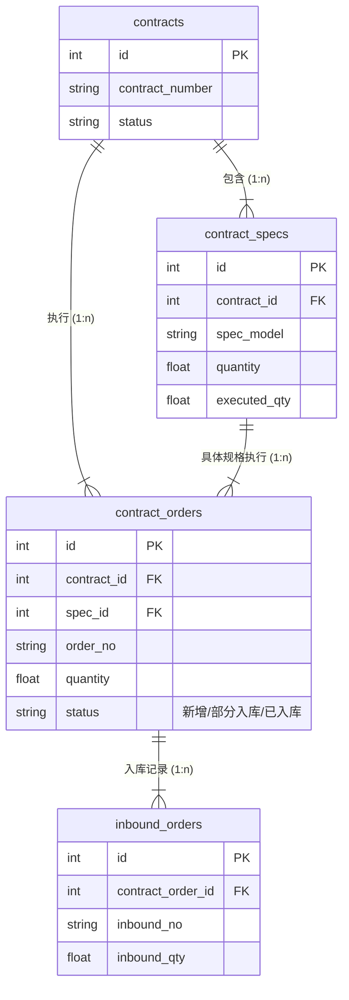

# PPOMS 数据库设计文档 V2.3.0168

## 1. 概述
本各档描述了 **生产采购订单管理系统 (PPOMS)** 的数据库设计方案。系统采用 **SQLite** 作为存储引擎，数据库文件名为 `purchase.db`。设计遵循轻量级、单文件部署原则，支持系统的核心业务流程，包括采购计划管理、订单执行跟踪、月度计划编制及自动推荐功能。

- **数据库版本**: V2.3.0168
- **数据库文件**: `purchase.db`
- **字符集**: UTF-8

---

## 2. 数据库表清单

| 表名 | 中文名称 | 业务模块 | 类型 | 说明 |
| :--- | :--- | :--- | :--- | :--- |
| **orders** | 采购订单主表 | 采购管理 | 核心 | 存储采购任务单的主体信息（单号、日期、类别等） |
| **order_details** | 订单明细表 | 采购管理 | 核心 | 存储具体的采购物资明细、规格、预算及执行状态 |
| **release_orders** | 采购下发记录表 | 采购管理 | 核心 | 记录按采购员拆分后的任务下发状态 |
| **monthly_plans** | 月度计划表 | 计划管理 | 核心 | 存储各部门提交的月度采购预算与需求计划 |
| **recommendations** | 智能推荐库 | 辅助功能 | 辅助 | 存储物资的历史采购属性（采购员、渠道等），用于自动填充 |
| **contracts** | 合同主表 | 合同管理 | 核心 | 存储合同基本信息（编号、名称、金额、供应商等） |
| **contract_specs** | 合同规格明细表 | 合同管理 | 核心 | 存储合同约定的物资规格、单价及总数量 |
| **contract_orders** | 合同执行订单表 | 合同管理 | 核心 | 基于合同开具的具体执行订单，含状态流转 |
| **inbound_orders** | 入库记录表 | 入库管理 | 核心 | 记录采购物资的入库流水，关联执行订单 |
| **contract_categories** | 合同类别字典 | 基础数据 | 字典 | 定义合同的分类（如模块、线缆、加工件等） |
| **suppliers** | 供应商字典 | 基础数据 | 字典 | 存储合格供应商名单 |
| **counter** | 单据计数器 | 系统基础 | 辅助 | 记录各类别订单的流水号，确保单号唯一 |
| **inbound_counter** | 入库单计数器 | 系统基础 | 辅助 | 记录入库单号的流水生成规则 |
| **units** | 单位/部门字典 | 基础数据 | 字典 | 存储申请单位/部门名称 |
| **purchasers** | 采购员字典 | 基础数据 | 字典 | 存储系统有效的采购员名单 |
| **purchase_status** | 采购状态字典 | 基础数据 | 字典 | 定义采购流程的状态流转节点 |
| **plan_months** | 计划月份字典 | 基础数据 | 字典 | 定义可选的计划月份（如 2601, 2602） |
| **print_config** | 打印配置表 | 系统配置 | 配置 | 存储各模块的打印列宽、显隐等JSON配置 |
| **main_layout** | 主表布局配置 | 系统配置 | 配置 | 存储主界面的表格列宽配置 |
| **detail_layout** | 明细布局配置 | 系统配置 | 配置 | 存储明细界面的表格列宽配置 |

---

## 3. 详细设计

### 3.1. orders (采购订单主表)
> 业务主键：`number`

| 字段名 | 数据类型 | 长度 | 必填 | 默认值 | 说明 |
| :--- | :--- | :--- | :--- | :--- | :--- |
| **number** | TEXT | 20 | 是 | - | **PK**, 订单编号 (如 CG-2601MP0001) |
| yymm | TEXT | 6 | 是 | - | 计划月份 (如 2601) |
| category | TEXT | 10 | 是 | - | 类别代码 (MP:民品, MPJ:机加, MPB:半成品) |
| unit | TEXT | 50 | 否 | - | 申请单位 |
| date | TEXT | 10 | 否 | - | 申请日期 (YYYY-MM-DD) |
| task_name | TEXT | 100 | 否 | - | 任务名称/项目摘要 |

### 3.2. order_details (订单明细表)
> 业务主键：`id` (自增)，逻辑关联：`order_number`

| 字段名 | 数据类型 | 长度 | 必填 | 默认值 | 说明 |
| :--- | :--- | :--- | :--- | :--- | :--- |
| **id** | INTEGER | - | 是 | AUTO | **PK**, 自增主键 |
| order_number | TEXT | 20 | 是 | - | **FK**, 关联 orders.number |
| detail_no | TEXT | 20 | 是 | - | 明细序号 (如 2601MP-1) |
| item_name | TEXT | 100 | 否 | - | 物品名称 (项目名称) |
| purchase_item | TEXT | 100 | 否 | - | 采购内容 |
| spec_model | TEXT | 100 | 否 | - | 规格型号/技术要求 |
| purchase_cycle | TEXT | 50 | 否 | - | 采购周期 |
| stock_count | TEXT | 20 | 否 | - | 库存数量 |
| purchase_qty | TEXT | 20 | 否 | - | 采购数量 |
| unit | TEXT | 20 | 否 | - | 单位 (个/套/kg等) |
| unit_price | TEXT | 20 | 否 | - | 预算单价 (元) |
| budget_wan | TEXT | 20 | 否 | - | 预算总价 (万元) |
| purchase_method | TEXT | 50 | 否 | - | 采购方式 (询比价/直接采购等) |
| purchase_channel | TEXT | 50 | 否 | - | 采购渠道 (网购/实体/厂家) |
| plan_time | TEXT | 20 | 否 | - | 计划到货时间 |
| demand_unit | TEXT | 50 | 否 | - | 需求单位/使用人 |
| plan_release | TEXT | 50 | 否 | - | 计划下达给(采购员) |
| progress_req | TEXT | 100 | 否 | - | 进度要求 |
| supplier | TEXT | 100 | 否 | - | 供方名称 |
| inquiry_price | TEXT | 20 | 否 | - | 询价/合同金额 (元) |
| tax_rate | TEXT | 20 | 否 | - | 税率 |
| actual_status | TEXT | 50 | 否 | - | 实际进度状态 |
| purchase_body | TEXT | 50 | 否 | - | 采购主体 |
| add_adjust | TEXT | 50 | 否 | - | 增补/调整标识 |
| remark | TEXT | 500 | 否 | - | 备注 |

### 3.3. contracts (合同主表)
> 业务主键：`id` (自增)

| 字段名 | 数据类型 | 必填 | 说明 |
| :--- | :--- | :--- | :--- |
| **id** | INTEGER | 是 | **PK**, 自增主键 |
| contract_number | TEXT | 是 | 合同编号 (唯一) |
| name | TEXT | 是 | 合同名称 |
| category | TEXT | 否 | 合同类别 (关联 contract_categories) |
| supplier | TEXT | 否 | 供应商 |
| sign_date | TEXT | 否 | 签订日期 |
| end_date | TEXT | 否 | 截止日期 |
| amount | REAL | 否 | 合同总金额 |
| status | TEXT | 否 | 状态 (执行中/已结案/作废) |
| attachment | TEXT | 否 | 附件路径 |
| remarks | TEXT | 否 | 备注 |
| created_at | TEXT | 是 | 创建时间 |

### 3.4. contract_specs (合同规格明细表)
> 业务主键：`id` (自增)，关联：`contract_id`

| 字段名 | 数据类型 | 必填 | 说明 |
| :--- | :--- | :--- | :--- |
| **id** | INTEGER | 是 | **PK**, 自增主键 |
| contract_id | INTEGER | 是 | **FK**, 关联 contracts.id |
| spec_model | TEXT | 是 | 规格型号 |
| unit | TEXT | 否 | 单位 |
| quantity | REAL | 是 | 签约数量 |
| unit_price | REAL | 是 | 单价 |
| total_price | REAL | 是 | 总价 |
| executed_qty | REAL | 否 | 已执行数量 (系统自动更新) |

### 3.5. contract_orders (合同执行订单表)
> 业务主键：`id` (自增)，关联：`contract_id`, `spec_id`

| 字段名 | 数据类型 | 必填 | 默认值 | 说明 |
| :--- | :--- | :--- | :--- | :--- |
| **id** | INTEGER | 是 | - | **PK**, 自增主键 |
| contract_id | INTEGER | 是 | - | **FK**, 关联 contracts.id |
| spec_id | INTEGER | 是 | - | **FK**, 关联 contract_specs.id |
| order_date | TEXT | 是 | - | 下单日期 |
| order_no | TEXT | 是 | - | 订单编号 |
| quantity | REAL | 是 | - | 下单数量 |
| unit_price | REAL | 是 | - | 单价 |
| total_price | REAL | 是 | - | 总价 |
| sales_order | TEXT | 否 | - | 关联销售单号 |
| prod_order | TEXT | 否 | - | 关联生产单号 |
| purch_plan_no | TEXT | 否 | - | 关联采购计划号 |
| status | TEXT | 否 | '新增' | 状态 (新增/部分入库/已入库) |
| remarks | TEXT | 否 | - | 备注 |

### 3.6. inbound_orders (入库记录表)
> 业务主键：`id` (自增)，关联：`contract_order_id`

| 字段名 | 数据类型 | 必填 | 说明 |
| :--- | :--- | :--- | :--- |
| **id** | INTEGER | 是 | **PK**, 自增主键 |
| inbound_no | TEXT | 是 | 入库单号 (RK-YYMMDD-CAT-XXXX) |
| contract_order_id | INTEGER | 是 | **FK**, 关联 contract_orders.id |
| contract_no | TEXT | 否 | 冗余合同编号 |
| order_no | TEXT | 否 | 冗余订单编号 |
| purch_plan_no | TEXT | 否 | 冗余采购计划号 |
| spec_model | TEXT | 否 | 冗余规格型号 |
| order_qty | REAL | 否 | 订单总数 |
| inbound_qty | REAL | 是 | 本次入库数 |
| warehouse_no | TEXT | 否 | 仓储单号 |
| inbound_date | TEXT | 是 | 入库日期 |
| operator | TEXT | 否 | 操作人 |
| create_time | TEXT | 是 | 创建时间 |
| remarks | TEXT | 否 | 备注 |

### 3.7. 基础字典表 (新增部分)

#### `contract_categories` (合同类别)
| 字段名 | 类型 | 说明 |
| :--- | :--- | :--- |
| **name** | TEXT | **PK**, 类别名称 (如: 模块, 线缆, 钣金) |

#### `suppliers` (供应商)
| 字段名 | 类型 | 说明 |
| :--- | :--- | :--- |
| **name** | TEXT | **PK**, 供应商名称 |

### 3.8. 计数器表 (新增部分)

#### `inbound_counter` (入库单计数器)
| 字段名 | 类型 | 说明 |
| :--- | :--- | :--- |
| **date_str** | TEXT | **PK**, 日期串 (如 260101) |
| **category** | TEXT | **PK**, 类别代码 (MOD, LIN等) |
| seq | INTEGER | 当前最大流水号 |

---

## 4. 表关系图 (ER Diagram) - 合同与入库模块

